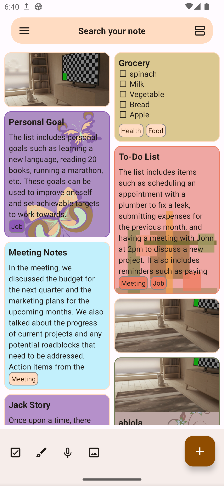

# Infinity for Reddit

Infinity For Reddit is a Reddit client on Android written in Java. It does not have any ads and it features a clean UI and smooth browsing experience.

Infinity For Reddit is available on the Google Play Store and F-Droid:

  

        

 
    <a href="https://github.com/othneildrew/Best-README-Template"><strong>Explore the docs »</strong></a>
 
<a href="https://github.com/mshdabiola/Play_NotePad">View Demo</a>
    ·
    <a href="https://github.com/mshdabiola/Play_NotePad/issues">Report Bug</a>
    ·
    <a href="https://github.com/mshdabiola/Play_NotePad/issues">Request Feature</a>
  

  
Table of Contents

  <ol>
    <li>
      <a href="#about-the-project">About The Project</a>
      <ul>
        <li><a href="#built-with">Built With</a></li>
      </ul>
    </li>
    <li>
      <a href="#getting-started">Getting Started</a>
      <ul>
        <li><a href="#prerequisites">Prerequisites</a></li>
        <li><a href="#installation">Installation</a></li>
      </ul>
    </li>
    <li><a href="#usage">Usage</a></li>
    <li><a href="#roadmap">Roadmap</a></li>
    <li><a href="#contributing">Contributing</a></li>
    <li><a href="#license">License</a></li>
    <li><a href="#contact">Contact</a></li>
    <li><a href="#acknowledgments">Acknowledgments</a></li>
  </ol>

## About The Project

Some highlight features:
- Lazy mode: Automatic scrolling of posts enables you to enjoy amazing posts without moving your thumb

## Built With

Major Frameworks

## Contribution

1. Contributions are what make the open source community such an amazing place to learn, inspire, and create. Any contributions you make are **greatly appreciated**.

2. Whether you're helping us fix bugs, improve the docs, or spread the word, we'd love to have you as part of the Gatsby community!

3. Thanks for your interest in contributing! There are many ways to contribute to this project. Get started here (Contributing.md link)

### Feedback

Don't forget to give the project a star! Thanks again!

You can use [Github Discussions](https://github.com/Docile-Alligator/Infinity-For-Reddit/discussions) for discussions about the app or just questions in general. There you can also submit Feature Requests (please read the instructions on how to submit a feature request first!) or if you are a developer fork this project and create a pull request

1. Fork the Project
2. Create your Feature Branch (`git checkout -b feature/AmazingFeature`)
3. Commit your Changes (`git commit -m 'Add some AmazingFeature'`)
4. Push to the Branch (`git push origin feature/AmazingFeature`)
5. Open a Pull Request

Here are other ways you can help:

* [Report bugs](https://github.com/Docile-Alligator/Infinity-For-Reddit/issues)
 * [Translate the app](https://poeditor.com/join/project?hash=b2IRyfaJv6)

 ## Development

 - Magisk builds on any OS Android Studio supports. Install Android Studio and do the initial setups.
- Clone sources: `git clone --recurse-submodules https://github.com/topjohnwu/Magisk.git`
- Install Python 3.6+ \
  (Windows only: select **'Add Python to PATH'** in installer, and run `pip install colorama` after install)
- Configure to use the JDK bundled in Android Studio:
  - macOS: `export JAVA_HOME="/Applications/Android Studio.app/Contents/jre/Contents/Home"`
  - Linux: `export PATH="/path/to/androidstudio/jre/bin:$PATH"`
  - Windows: Add `C:\Path\To\Android Studio\jre\bin` to environment variable `PATH`
- Set environment variable `ANDROID_SDK_ROOT` to the Android SDK folder (can be found in Android Studio settings)
- Run `./build.py ndk` to let the script download and install NDK for you
- To start building, run `build.py` to see your options. \
  For each action, use `-h` to access help (e.g. `./build.py all -h`)
- To start development, open the project with Android Studio. The IDE can be used for both app (Kotlin/Java) and native sources.
- Optionally, set custom configs with `config.prop`. A sample `config.prop.sample` is provided.

(<a href="#top">back to top</a>)

## License

AntennaPod is licensed under the GNU General Public License (GPL-3.0). You can find the license text in the `LICENSE` file.

(<a href="#top">back to top</a>)

## Contact

Your Name - [@your_twitter](https://twitter.com/your_username) - email@example.com

Project Link: [https://github.com/Docile-Alligator/Infinity-For-Reddit](https://github.com/Docile-Alligator/Infinity-For-Reddit)

(<a href="#top">back to top</a>)

## Acknowledgments
