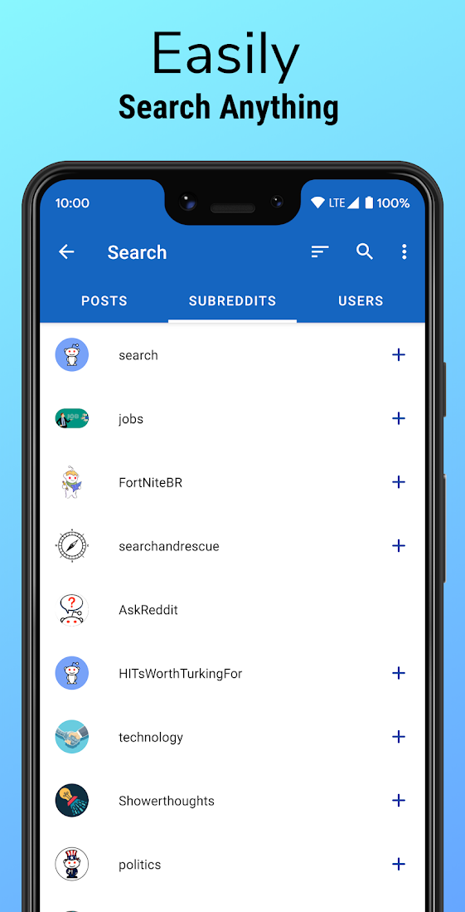
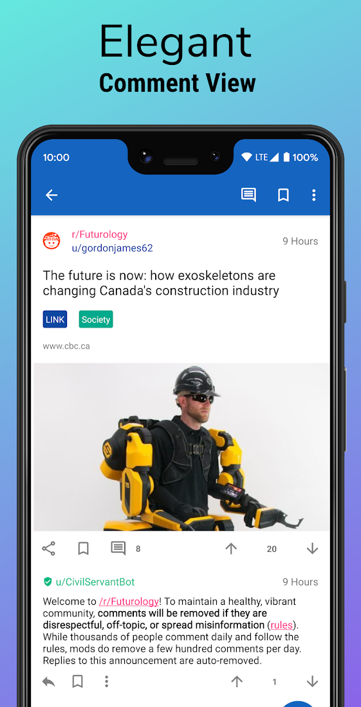

# Play NotePad

Play Notepad is a versatile note-taking app that allows you to easily capture and organize your
thoughts, ideas, and tasks. With a variety of features, Play Notepad makes it easy to stay on top of
your notes and stay organized.

Play NotePad is available on the Google Play Store:

  

        

<a href="https://github.com/mshdabiola/Play_NotePad">View Demo</a>
·
<a href="https://github.com/mshdabiola/Play_NotePad/issues">Report Bug</a>
·
<a href="https://github.com/mshdabiola/Play_NotePad/issues">Request Feature</a>
  

## About The Project

Some highlight features:

- Lazy mode: Automatic scrolling of posts enables you to enjoy amazing posts without moving your
  thumb
- Easily create and edit text notes.
- Snap a photo or choose one from your camera roll to attach to a note.
- Draw freehand sketches and diagrams to annotate your notes.
- Record audio notes and play them back later.
- Keep important notes at the top of your list for easy access.
- Create checklists and keep track of your tasks with checkboxes.
- Organize your notes by tagging them with labels.
- Duplicate notes for easy reference.
- Share your notes with others via email or messaging.
- Set reminders for notes so you never forget important tasks or events.
- Delete notes you no longer need.
- Keep your notes organized by archiving old or completed tasks.
- Add color to your notes to make them more visually appealing.
- Add an image to the background of your notes for a more personalized look.
- View your notes in list or column format for easy reading and editing.
- Search your notes by keyword label and type.
- Use the app offline and access your notes at any time.

## Built With

## Clean architecture with 3 main modules

- Declarative UI (with [Jetpack Compose](https://developer.android.com/jetpack/compose))
    - Compose Navigation (
      with [Hilt Support](https://developer.android.com/jetpack/compose/libraries#hilt-navigation)
      and Assisted Inject Example)
- Data (for database, API and preferences code)
- Domain (for business logic and models)
- AndroidApp (for UI logic, with MVVM)
- This version brings [Modularization](https://developer.android.com/topic/modularization)
- Version Management (
  with [Version catalog](https://docs.gradle.org/current/userguide/platforms.html))
- Shared Build Logic (
  with [Convention plugins](https://docs.gradle.org/current/samples/sample_convention_plugins.html))
- Dependency injection (with [Hilt](http://google.github.io/hilt/))
- Reactive programming (
  with [Kotlin Flows](https://kotlinlang.org/docs/reference/coroutines/flow.html))
- Android architecture components to share ViewModels during configuration changes
- [Splash Screen](https://developer.android.com/develop/ui/views/launch/splash-screen) Support
- Google Material 3 [Material Design](https://material.io/blog/android-material-theme-color) library

- Edge To Edge Configuration

[//]: # (## Tests)

[//]: # (- [Mockk]&#40;https://mockk.io/&#41; library)

[//]: # (- Unit tests)

[//]: # (- Application tests)

[//]: # (    - example on how to work with tests)

[//]: # (- Activity tests &#40;with [Compose Testing]&#40;https://developer.android.com/jetpack/compose/testing&#41;&#41;)

[//]: # (    - example on how to work with coroutine scopes in tests)

## Contribution

1. Contributions are what make the open source community such an amazing place to learn, inspire,
   and create. Any contributions you make are **greatly appreciated**.

2. Whether you're helping us fix bugs, improve the docs, or spread the word, we'd love to have you
   as part of the Gatsby community!

3. Thanks for your interest in contributing! There are many ways to contribute to this project. Get
   started here (Contributing.md link)

### Feedback

Don't forget to give the project a star! Thanks again!

You can use [Github Discussions](https://github.com/mshdabiola/Play_NotePad/discussions) for
discussions about the app or just questions in general. There you can also submit Feature Requests (
please read the instructions on how to submit a feature request first!) or if you are a developer
fork this project and create a pull request

1. Fork the Project
2. Create your Feature Branch (`git checkout -b feature/AmazingFeature`)
3. Commit your Changes (`git commit -m 'Add some AmazingFeature'`)
4. Push to the Branch (`git push origin feature/AmazingFeature`)
5. Open a Pull Request

Here are other ways you can help:

* [Report bugs](https://github.com/mshdabiola/Play_NotePad/issues)

* [Translate the app](https://poeditor.com/join/project/rdWI3SpnSW)

## Development

## License

Play Notepad is licensed under the GNU General Public License (GPL-3.0). You can find the license
text in the `LICENSE` file.

## Contact

mshdabiola - [@Mshdabiola](https://twitter.com/mshdabiola) - mshdabiola@gmail.com

## Acknowledgments
